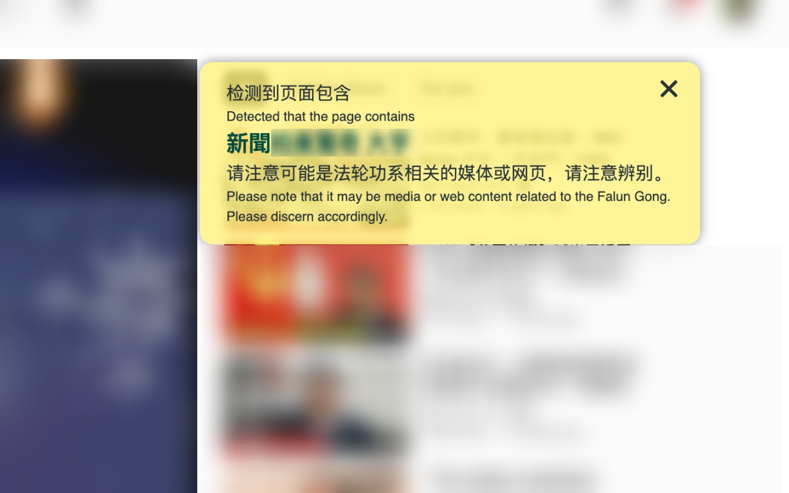
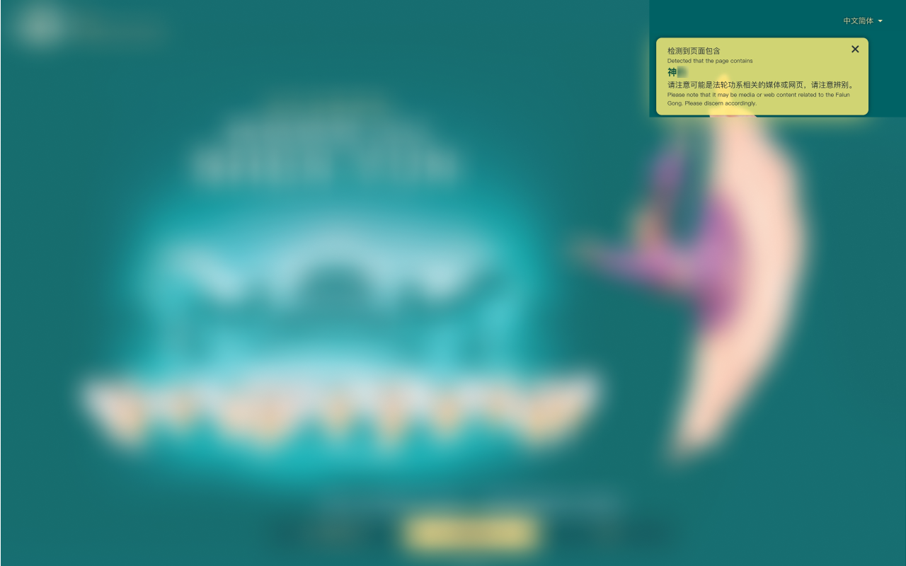
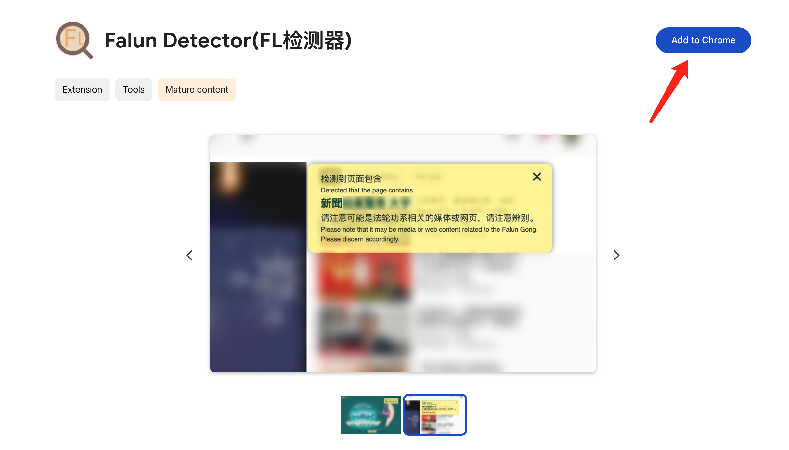
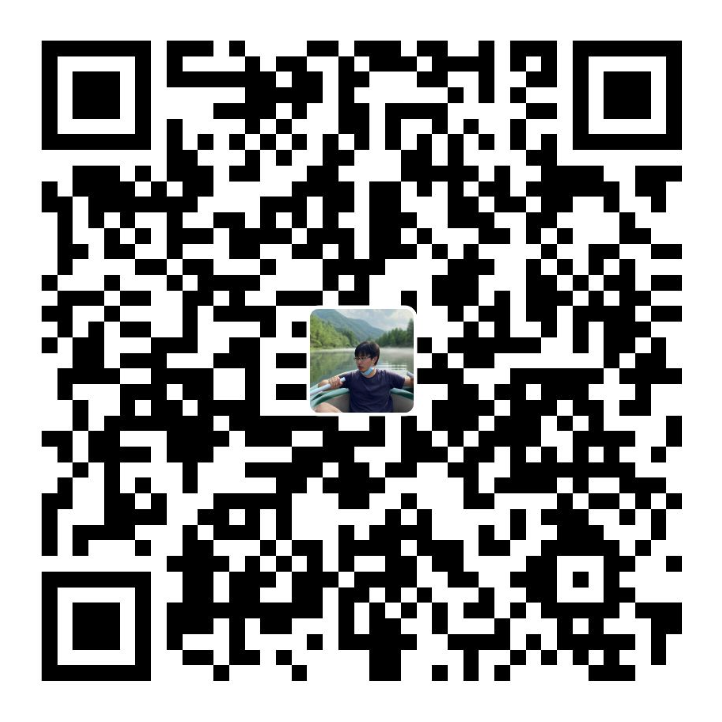

  

<h1 align="center">
  Falun Detector(FL 检测器)
</h1>

<!-- @import "[TOC]" {cmd="toc" depthFrom=1 depthTo=6 orderedList=false} -->

<!-- code_chunk_output -->

- [Intro 简介](#intro-简介)
- [Installation 安装](#installation-安装)
- [Contributing 贡献](#contributing-贡献)
- [Additional information 补充说明](#additional-information-补充说明)
  - [Why this extension? 为什么做这个插件？](#why-this-extension-为什么做这个插件)
  - [Detection Logic 检测逻辑](#detection-logic-检测逻辑)
- [Donation 捐赠](#donation-捐赠)

<!-- /code_chunk_output -->

## Intro 简介

Chrome extension.

Detect automatically whether it is media or websites related to Falun Gong.

用于自动检查当前网页是否是法轮功系的媒体或网站。

If relevant content is detected, a prompt will appear in the upper right corner of the page.

若检测出相关内容，会在页面右上角提示。

like below:

如下所示：

## Installation 安装

Please visit Chrome Web Store to install.

请访问 Chrome Web Store 安装。

Chrome Extension [Falun Detector(FL 检测器)](https://chromewebstore.google.com/detail/falun-detectorfl%E6%A3%80%E6%B5%8B%E5%99%A8/offfnjcopfmjjlgicomblholdioonenc)

## Contributing 贡献

If you have any questions or suggestions, please feel free to open an [issue](https://github.com/Gaohaoyang/falun-detector/issues) or [pull request](https://github.com/Gaohaoyang/falun-detector/pulls).

如果有任何问题或建议，欢迎提 [issue](https://github.com/Gaohaoyang/falun-detector/issues) 或 [pull request](https://github.com/Gaohaoyang/falun-detector/pulls)。

## Additional information 补充说明

### Why this extension? 为什么做这个插件？

Thanks for Mr. Wang Zhian's YouTube videos.

感谢 王志安 先生发布的几个相关视频

- https://www.youtube.com/watch?v=sMLWpff7fUo
- https://www.youtube.com/watch?v=b09IPGBoHkc
- https://www.youtube.com/watch?v=HwoLIFbsRFE

News media should strive to be as fair and objective as possible. However, it is evident that media affiliated with Falun Gong has not achieved this. In order to assist users in discerning, a Chrome extension has been developed specifically for this purpose.

新闻媒体应该尽可能的公正客观，但是显然法轮功旗下的媒体没有做到这一点，为了帮助网友分辨，特意开发了这个 Chrome 插件。

### Detection Logic 检测逻辑

- 对于 YouTube，检测 url 和 up 主名称是否包含关键词

  For YouTube, check if the URL and the uploader's name contain keywords.

- 对于其他网站，检测 url 和是否包含关键词

  For other websites, check if the URL contains keywords.

## Donation 捐赠

If you find this project useful, you can buy me a cup of coffee :smile:

Donation methods:

- Github Sponsors
  - https://github.com/sponsors/Gaohaoyang
- Paypal
  - https://www.paypal.com/paypalme/HaoyangGao
- Wechat Pay
  
- AliPay
   

Enjoy it! :smile:
